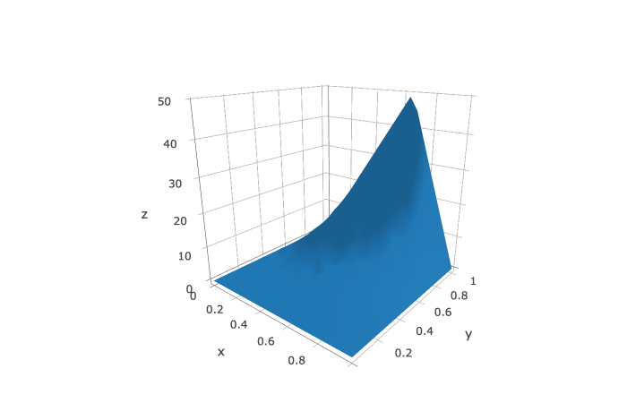

- [Background](#org54289ec)
- [Results](#org5dd4804)


<a id="org54289ec"></a>

# Background

This `Stan` demo implements the Walk-on-sphere(WOS) method to solve the Laplace equation on a rectangle. This is the so-called probabilistic mesh-free method for PDE solution. Essentially the probabilistic interpretations of Laplace equation says the solution is the mean of exit-points' function values of Brownian motion. Instead of sampling the path of the Brownian motion, we only need to sample the exit-points of the Brownian motion that beginning at the location where we wish to find PDE solution. This is a simplified version of **Feyman-Kac formula**, which connects parabolic PDE with Brownian motion. Since there is no inference, we run `Stan` with `num_samples=1` and `algorithm=fixed_param`.

<a id="org5dd4804"></a>

# Results

With the data file input

```R
tolerance <- 0.00001                    # close-to-boundary tolerance
m <- 20                                 # nb. of grids in x-dir
n <- 20                                 # nb. of grids in y-dir
N <- 5000                               # samples to take
                                        # for each solution
```

the following plot shows the solution surface. 
